# ブラウザ配信ブリッジ（デモ版）仕様書

リポジトリ名：**`browser-live-bridge-demo`**

---

## 1. 概要

### 1.1 課題

配信ソフト（OBS等）をインストールせず、**ブラウザのタブを開くだけ**で、画面共有・カメラ・マイクを合成したライブ映像を配信する。

ブラウザは RTMP を直接話せない（生の TCP ソケットを持たない）ため、ブラウザ単体では配信受け口へ到達できない。本成果物は、この断絶を **ブラウザ側エンコード＋中継サーバーによる多重化パススルー** で埋める設計を、動く展示物として体験可能にするものである。

### 1.2 対象エディション

**デモ版（アイデアの視覚化）**

技術と UX を体験させる展示物として、安全・手軽に動かせることを最優先する。デザイン・測定・保守・監視は対象外とする。

### 1.3 送出先の扱い

送出先は **自プロセス内のローカル ingest（RTMP 受け口）** とする。ネットワーク越しの呼び出し・キーを必要とする通信は一切行わない。

ブラウザから中継サーバーまでの配信パイプライン（キャプチャ・合成・H.264/AAC エンコード・独自フレーミング転送・FLV 多重化・RTMP ハンドシェイク・publish）は本番と同一の構造を持ち、最終の送出先のみをローカル ingest に向ける。受け口に到達した映像はモニター画面で再生でき、配信が成立していることを視覚的に確認できる。

---

## 2. プラットフォーム選定

### 2.1 ターゲットの判別

成果物を直接操作・視聴するのは**人間**である。よってターゲットは人間向けとする。

### 2.2 プラットフォーム

**ウェブ** を選択する。

- 「ブラウザから」という要件が課題そのものに含まれており、インストール不要であることが提供価値の中核である
- 画面共有 API（`getDisplayMedia`）・メディアデバイス API・エンコード API はブラウザに存在し、これらを使うこと自体が展示内容である
- 動的な入力（デバイス選択・レイアウト変更・配信制御）に応じて出力が変わるため、電子書籍・動画は該当しない

### 2.3 構成方針

デモ版の簡略構成（Cloudflare 一本化）は **選択しない**。長時間の WebSocket 接続と RTMP publish を伴う実時間中継は、CRUD・表示が主体の構成に該当しないためである。

Next + Rails を基本とし、実時間通信を担う中継サーバーとして Gin を追加する。

| 層 | 技術 | デプロイ先 | 役割 |
|---|---|---|---|
| フロントエンド | Next.js（TypeScript） | Vercel（無料） | 配信スタジオ画面・モニター画面 |
| アプリケーション | Rails | Railway（無料） | セッション・配信レコード・チャット・SQLite の管理 |
| 中継 | Gin（Go） | Railway（無料） | WebSocket 受信・FLV 多重化・RTMP publish・ローカル ingest・モニター配信 |

中継層を Go とするのは、1 接続あたり毎秒 30 前後のメディアフレームを低遅延で捌く必要があり、高速並列処理・実時間通信の要件に該当するためである。

DB は SQLite とし、Rails のみが保持する。中継層は状態を永続化せず、健全性とイベントを Rails の内部エンドポイントへ通知する。中継層とアプリケーション層の通信は自システム内の通信であり、外部 API に該当しない。

---

## 3. 用語定義

| 用語 | 定義 |
|---|---|
| ソース | 配信に取り込む入力。画面共有・カメラ・マイク・タブ音声・テストカードの 5 種 |
| 主映像 | 合成後フレームの背景全面を占める映像 |
| ワイプ | 主映像の上に重ねる小窓映像 |
| メディアクロック | 実時計から独立した、フレーム数・サンプル数を基準とする単調増加の時刻 |
| 配信トークン | 配信ごとに発行される推測不可能な不透明識別子。モニター URL の構成要素 |
| セッションキー | ブラウザごとに発行される不透明識別子。DB レコードのオーナーキー |
| ローカル ingest | 中継プロセス内に置かれた RTMP 受け口。送出先の代替物 |
| モニター | ローカル ingest に到達した映像を再生する視聴側画面 |
| 滞留時間 | 送信待ちキューに積まれた最古のフレームが待機している時間 |

---

## 4. スコープ

### 4.1 対象

- 画面共有・カメラ・マイク・タブ音声の取得と合成
- ブラウザ側での H.264 / AAC エンコード
- 中継サーバーへの転送と、FLV 多重化・RTMP publish
- ローカル ingest への到達確認と、モニター画面での再生
- 回線劣化・ソース喪失・接続断に対する適応と復旧
- 擬似視聴者数・擬似チャットによる配信体験の再現

### 4.2 対象外

- 外部サービスへの送出、およびそのための資格情報の入力・保持
- ユーザー認証・認可
- 録画ファイルの保存とダウンロード
- 複数配信の同時運用、および配信の予約
- 映像の再エンコード（中継層は多重化のみを行う）

---

## 5. システム構成

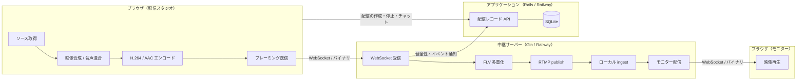

---

## 6. 配信パイプライン仕様

### 6.1 全体方針

中継層で映像を再エンコードしない。ブラウザ側で RTMP がそのまま受け取れる符号化形式（H.264 / AAC）まで仕上げ、中継層は容器の詰め替えのみを行う。これにより中継層の処理量は接続数に対して線形かつ小さく保たれ、無料枠の計算資源で成立する。

### 6.2 ソース仕様

| ソース種別 | 取得手段 | 既定の役割 | 欠落時の扱い |
|---|---|---|---|
| 画面共有 | 画面共有 API | 主映像 | カメラを主映像に昇格。カメラも無い場合はテストカード |
| カメラ | メディアデバイス API | ワイプ | ワイプを非表示にして継続 |
| マイク | メディアデバイス API | 音声（基準音量） | 無音生成器に切替えて継続 |
| タブ音声 | 画面共有 API の音声トラック | 音声（副音量） | 混合対象から除外して継続 |
| テストカード | 内部生成 | 代替の主映像 | 常時利用可能 |

**要件**

- テストカードは第一級のソースとして扱う。カメラ・マイクを持たない端末、および全ての許可が拒否された状態でも配信を開始できること
- 各トラックの終了は監視対象とし、終了を検知した時点で上表の欠落時の扱いへ遷移すること。映像が停止したまま配信が継続する状態を作らないこと
- ソースの追加・除去は配信中に行えること。ソース構成の変化は配信の中断を伴わないこと

### 6.3 映像合成仕様

**要件**

- 出力解像度は入力解像度に依存せず固定とする。取得元が高解像度である場合は縮小して合成すること
- 主映像は縦横比を保ったまま出力枠に内接させ、余白は単色で埋めること
- ワイプは出力枠の右下に配置し、幅は出力幅に対する比率で定義すること。余白・角の丸めも比率で定義し、絶対値を用いないこと
- 合成ループは描画フレームの供給に依存しない時間駆動とすること。タブが非アクティブになった場合、および最小化された場合も、規定のフレームレートで合成が継続すること
- 合成の結果は毎回 1 枚の完成フレームとして確定し、部分更新に依存しないこと

### 6.4 音声混合仕様

**要件**

- マイクとタブ音声を混合する。タブ音声はマイクより低い比率で混合し、話者の音声が埋もれないこと
- 混合後の信号は上限を超えないよう抑制すること
- **音声フレームは常時途切れなく生成すること。** 音声ソースが 1 つも存在しない場合も無音のフレームを生成し続けること。音声の供給停止は受け口側で接続断と解釈されるためである

### 6.5 エンコード仕様

| 項目 | 値 |
|---|---|
| 出力解像度 | 1280 × 720 |
| フレームレート | 30 fps |
| 映像符号化 | H.264（Baseline, Level 3.1） |
| キーフレーム間隔 | 2 秒 |
| 音声符号化 | AAC-LC |
| サンプリング周波数 | 48 kHz |
| チャンネル数 | 2 |
| 音声ビットレート | 128 kbps |
| 映像ビットレート初期値 | 2500 kbps |
| 映像ビットレート下限 | 800 kbps |
| 映像ビットレート上限 | 4000 kbps |

**要件**

- エンコーダの初期化情報（映像・音声それぞれの復号器設定）は、最初のメディアフレームより前に送信すること。再接続時は再送すること
- **時刻はメディアクロックで採番すること。** 映像はフレーム番号、音声は累積サンプル数から時刻を導き、実時計を用いないこと
- スリープ復帰等でメディアクロックに規定を超える空白が生じた場合は、直前のフレームの保持と無音で空白を埋め、その直後にキーフレームを発行すること

### 6.6 転送プロトコル仕様

WebSocket 上のバイナリ転送とし、1 メッセージ 1 フレームとする。

**フレーム構造**

| 領域 | 長さ | 内容 |
|---|---|---|
| 識別子 | 2 バイト | プロトコル識別 |
| 版 | 1 バイト | プロトコル版 |
| 種別 | 1 バイト | 映像設定・映像・音声設定・音声・制御 |
| 属性 | 1 バイト | キーフレームか否か |
| 時刻 | 8 バイト | メディアクロック（マイクロ秒） |
| 本文長 | 4 バイト | 本文のバイト数 |
| 本文 | 可変 | 符号化データまたは制御内容 |

**制御メッセージ**

| 方向 | 種別 | 内容 |
|---|---|---|
| 送信側 → 中継 | 開始通知 | セッションキー・配信トークン・エンコードプロファイル |
| 送信側 → 中継 | 状態報告 | 滞留時間・破棄フレーム数・現在の目標ビットレート |
| 送信側 → 中継 | 終了通知 | 終了理由 |
| 中継 → 送信側 | 受領応答 | 受領済み時刻 |
| 中継 → 送信側 | キーフレーム要求 | 即時のキーフレーム発行を求める |
| 中継 → 送信側 | 抑制指示 | 中継側が観測した逼迫に基づく目標ビットレート |
| 中継 → 送信側 | 致命通知 | 継続不能な理由 |

**要件**

- 開始通知の完了前に受信したメディアフレームは破棄すること
- 開始通知のセッションキーと配信トークンの組がレコードと一致しない場合、接続を確立しないこと

### 6.7 中継・多重化・送出仕様

**要件**

- 受信したフレームを FLV のタグ列へ変換し、RTMP の publish として送出すること。符号化データの再エンコードを行わないこと
- 映像設定・音声設定を受け取るまで publish を開始しないこと
- タグの時刻は受信フレームの時刻をそのまま用い、中継側で再採番しないこと
- 到達した映像は購読可能な形で保持し、モニターへ配信すること。保持は直近の一定時間分に限り、蓄積を無制限に伸ばさないこと
- モニターの新規接続に対しては、直近のキーフレーム以降を先頭として配信すること

---

## 7. 適応制御要件

送信待ちキューの滞留時間を毎秒評価し、目標ビットレートと破棄方針を決定する。

| 条件 | 動作 |
|---|---|
| 滞留時間が 1500 ms を超える状態が 2 回連続 | 目標ビットレートを 30% 引き下げる（下限まで） |
| 滞留時間が 300 ms 未満、かつ直近 10 秒の破棄が皆無 | 目標ビットレートを 10% 引き上げる（上限まで） |
| 滞留時間が 4000 ms を超える | キュー内の非キーフレームの映像を古い順に破棄する |
| 滞留時間が 8000 ms を超える | 配信状態を「劣化」とし、以後 10 秒継続した場合に再接続へ移行する |

**要件**

- **音声フレームは破棄対象としないこと。** 音声の欠落は映像の欠落より体験の劣化が大きく、かつ受け口側の接続維持に必要であるため
- キーフレームは破棄対象としないこと
- 目標ビットレートの変更は段階的に行い、1 秒あたり 1 回を上限とすること
- 中継側からの抑制指示は、送信側の判定より優先すること
- 引き下げ後の回復は引き下げより緩やかであること（引き下げ幅より引き上げ幅を小さく定義する）

---

## 8. 異常検知と復旧要件

| 事象 | 検知 | 動作 |
|---|---|---|
| 画面共有の停止 | 映像トラックの終了 | 代替表示へ切替え、配信を継続する。停止した旨を画面に表示する |
| カメラの喪失 | 映像トラックの終了 | ワイプを非表示にし、配信を継続する |
| マイクの喪失 | 音声トラックの終了 | 無音生成に切替え、配信を継続する |
| 全映像ソースの喪失 | 主映像候補が皆無 | テストカードへ切替え、配信を継続する |
| 接続断 | WebSocket の切断 | 指数的な間隔で再接続する。再接続後に設定情報を再送し、キーフレームを発行する |
| 再接続の失敗継続 | 規定時間の経過 | 配信を失敗として終了し、理由を記録する |
| 端末の休止と復帰 | メディアクロックの空白 | 空白を補填し、キーフレームを発行する |
| 二重配信の試行 | 配信ロックの取得失敗 | 配信を開始せず、既存の配信が存在する旨を表示する |

**要件**

- 再接続の待機間隔は指数的に増加させ、上限を設けること。再接続の試行は規定時間で打ち切ること
- 再接続中もソースの取得・合成・エンコードは停止しないこと。送信のみを保留し、キューの破棄方針に従うこと
- 復旧は自動で行い、利用者の操作を必要としないこと。ただし配信の再開を利用者が明示的に選べる導線を残すこと

---

## 9. 排他制御と所有権

**要件**

- 1 セッションにつき同時に成立する配信は 1 本とする。配信の開始時に配信ロックを取得し、取得できない場合は開始しないこと
- 同一ブラウザの複数タブから同時に配信が開始されないよう、タブ間で排他を取ること
- 配信ロックは定期的な生存通知によって維持し、通知が途絶えた場合は自動的に解放されること
- **DB のすべてのテーブルにセッションキーを付与し、セッションキーが一致しないレコードの参照・更新・削除を一切行えないこと**
- 配信トークンは推測不可能な長さとし、セッションキーから導出しないこと

---

## 10. モニター（限定公開）仕様

**要件**

- モニター URL は配信トークンを含む推測不可能な URL とする。URL を知る者のみが到達できること
- **モニターで行えるのは、ローカル ingest に到達した映像ストリームの購読のみとする。** 配信レコード・チャット・健全性ログを含む DB レコードへの参照・操作は、配信者本人のセッション以外から一切行えないこと
- モニターは配信の停止に追随して再生を終了し、終了した旨を表示すること
- モニターの同時接続数には上限を設け、上限到達時は新規接続を受け付けないこと
- モニターは配信トークンの有効期間内に限り到達可能とし、配信終了後は購読を受け付けないこと

---

## 11. 擬似視聴者数・擬似チャット仕様

配信体験を成立させるため、視聴者数とチャットをローカルで生成する。外部からの取得は行わない。

**要件**

- 視聴者数は配信トークンを種とする決定的な生成規則により、経過時間の関数として算出すること。同一配信を再度開いた場合に同じ推移を再現できること
- 視聴者数は急峻な跳躍を持たず、連続的に増減すること
- チャットは定型文の集合から一定の間隔で生成すること。生成間隔は一定値ではなく幅を持たせること
- **投稿者ラベルは個人を特定しない記号とすること**（氏名・ニックネーム・メールアドレスを用いないこと）
- 配信者本人も投稿でき、投稿は生成分と区別して表示されること
- 擬似生成であることを画面上に明示すること

---

## 12. 画面仕様

### 12.1 配信スタジオ画面

| 領域 | 内容 |
|---|---|
| プレビュー | 合成後のフレームを表示する。実際に送出されるものと同一の構図であること |
| ソース制御 | 画面共有・カメラ・マイク・タブ音声の取得と解除。各ソースの状態を表示する |
| 配信制御 | 配信の開始・停止。配信状態を表示する |
| 健全性 | 送出ビットレート・目標ビットレート・滞留時間・破棄フレーム数・接続状態を表示する |
| 視聴情報 | 擬似視聴者数とモニター URL を表示する。URL は複製操作を備える |
| チャット | 擬似チャットの表示と、配信者の投稿 |
| イベントログ | ソース喪失・再接続・抑制等の発生を時系列で表示する |

### 12.2 モニター画面

| 領域 | 内容 |
|---|---|
| プレイヤー | 受け口に到達した映像を再生する |
| 状態表示 | 配信中・終了・到達不能の別を表示する |
| 遅延表示 | 送出からの経過時間の目安を表示する |

---

## 13. データ設計

### 13.1 テーブル一覧

| テーブル | 用途 |
|---|---|
| sessions | ブラウザごとのセッション |
| broadcasts | 配信 1 本 |
| broadcast_sources | 配信に紐づくソース構成 |
| broadcast_locks | セッション単位の配信ロック |
| health_samples | 健全性の時系列 |
| broadcast_events | 配信中に発生した事象 |
| audience_samples | 擬似視聴者数の時系列 |
| chat_messages | 擬似チャットおよび配信者の投稿 |

すべてのテーブルは `session_id` を保持し、オーナーキーとして参照条件に必ず含める。

### 13.2 マスタデータ件数

| 区分 | 件数 |
|---|---|
| ソース種別 | 5 |
| レイアウトプリセット | 3 |
| エンコードプロファイル | 1 |
| 配信状態 | 10 |
| イベント種別 | 18 |
| 破棄・抑制の閾値段階 | 4 |
| 擬似チャット定型文 | 40 |

---

## 14. ER図

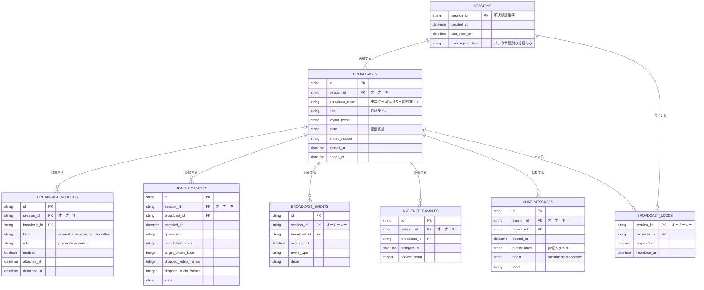

---

## 15. DFD

### 15.1 コンテキストレベル

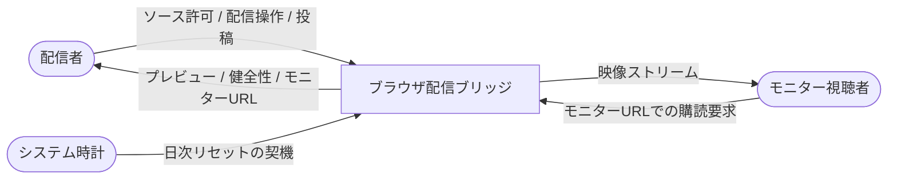

### 15.2 詳細レベル

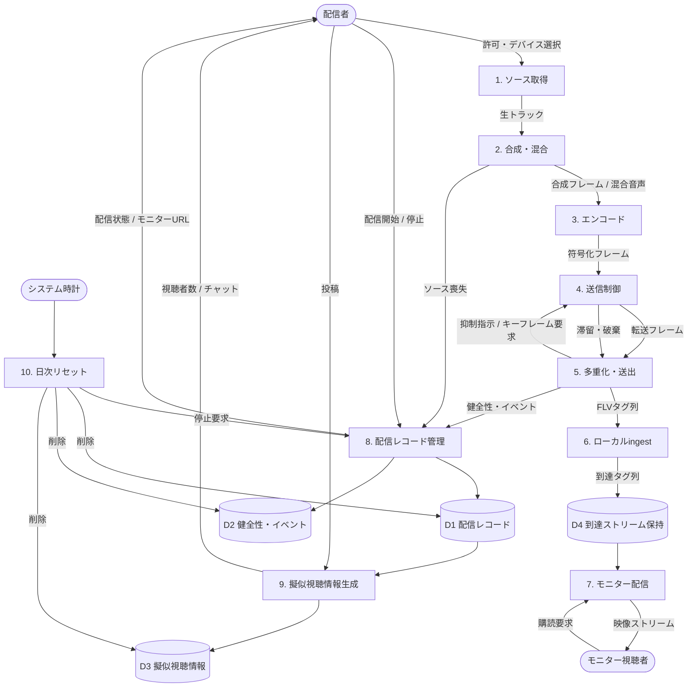

---

## 16. シーケンス図

### 16.1 配信開始

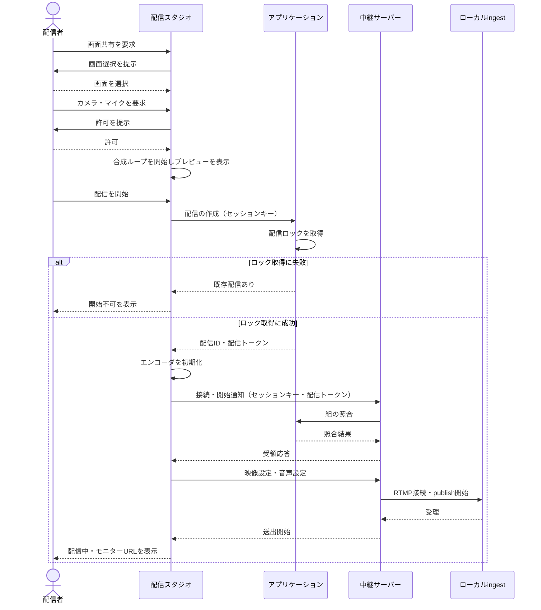

### 16.2 定常送出と適応

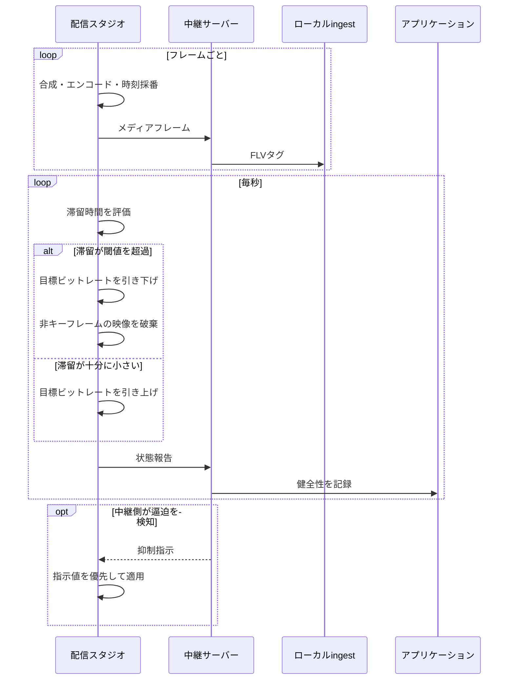

### 16.3 接続断からの復旧

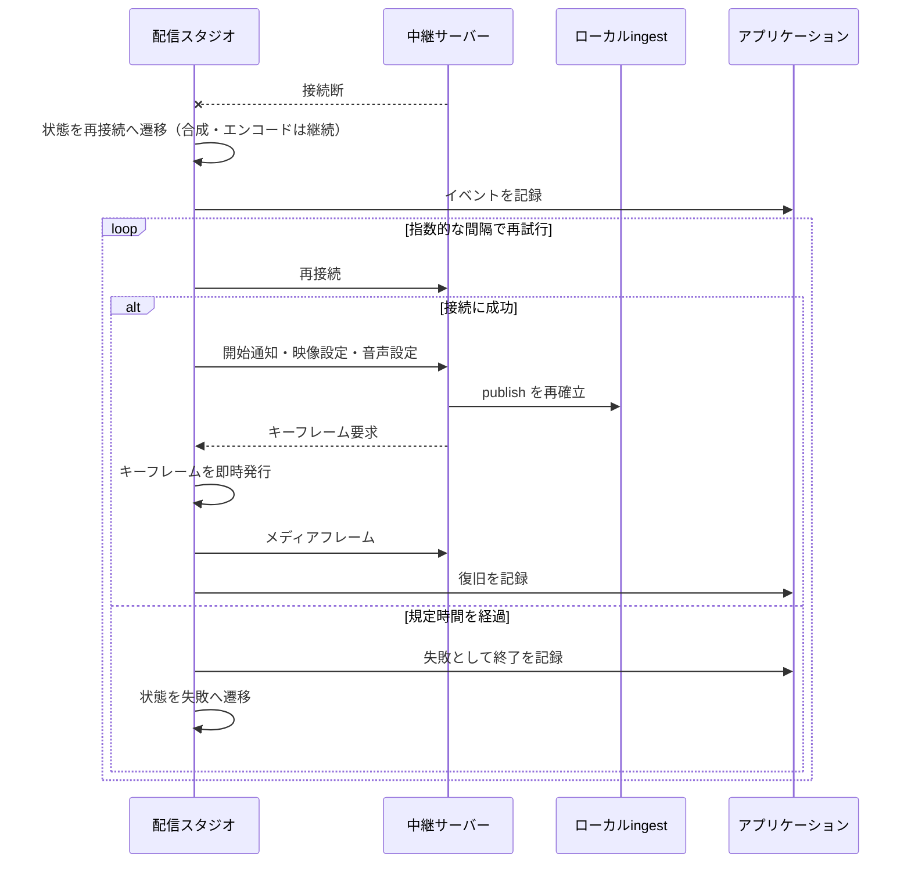

### 16.4 モニターの購読

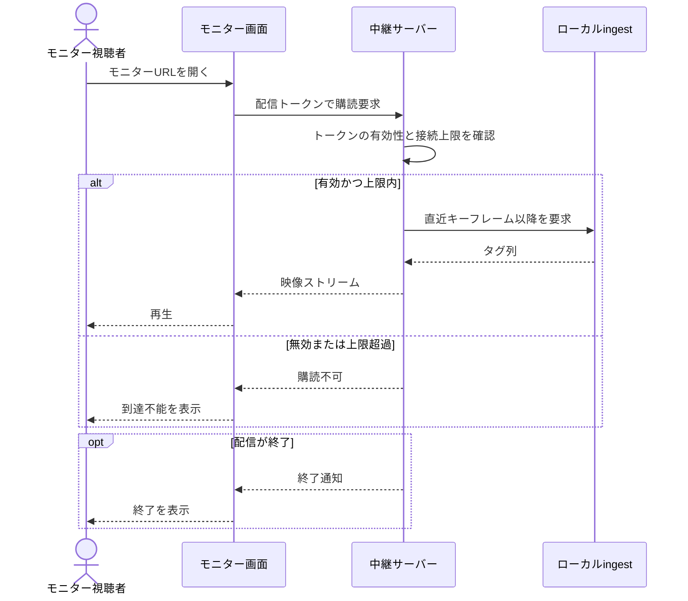

### 16.5 日次リセット

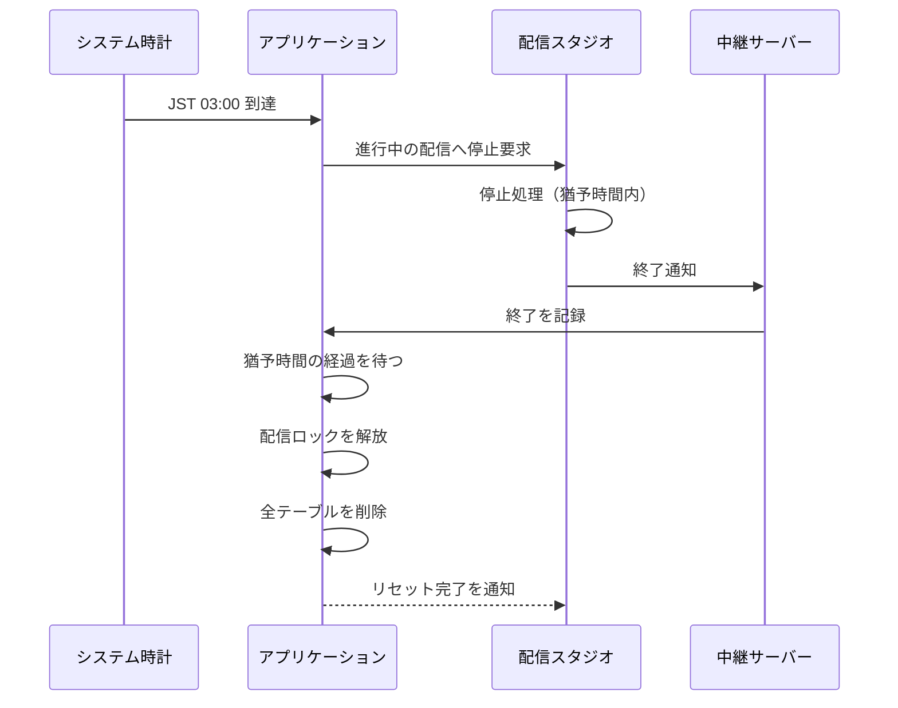

---

## 17. クラス図

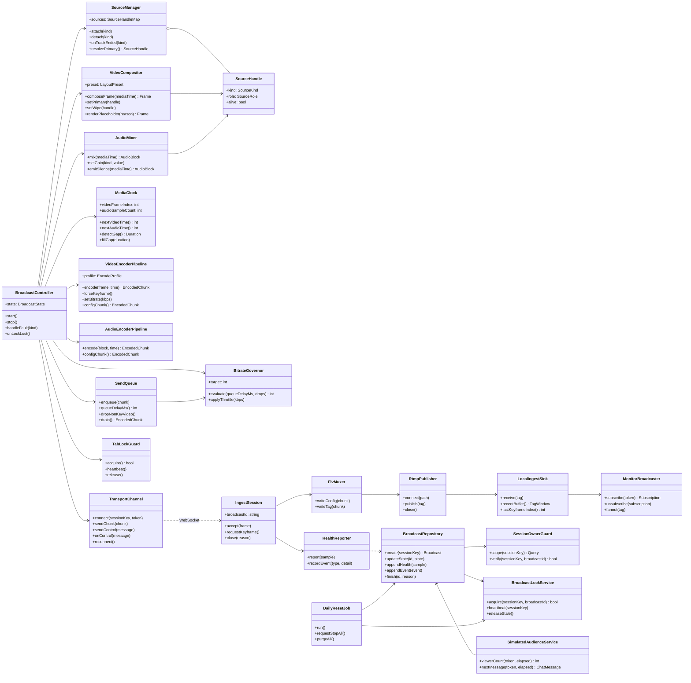

---

## 18. 状態遷移図

### 18.1 配信セッション

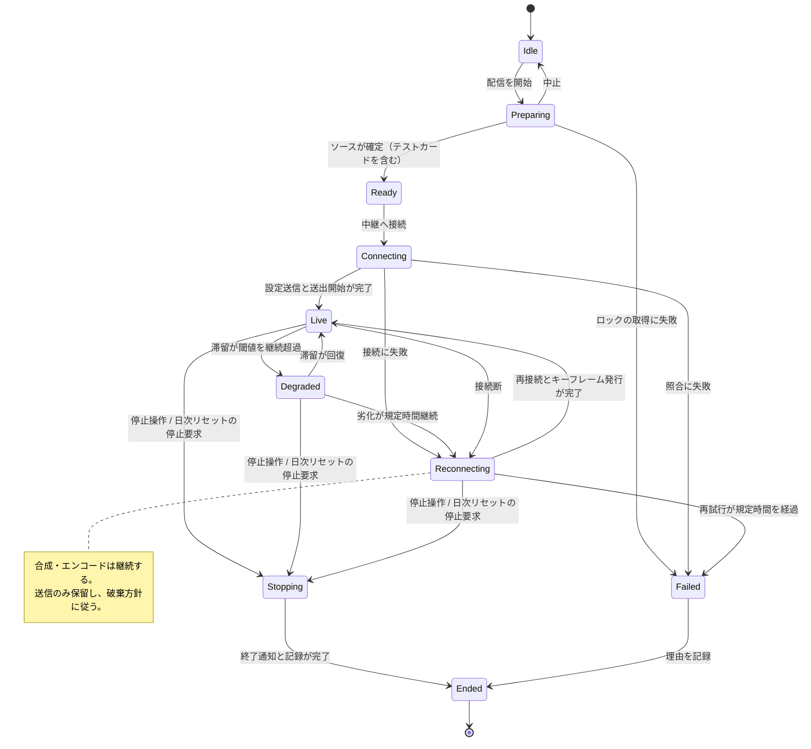

### 18.2 ソース

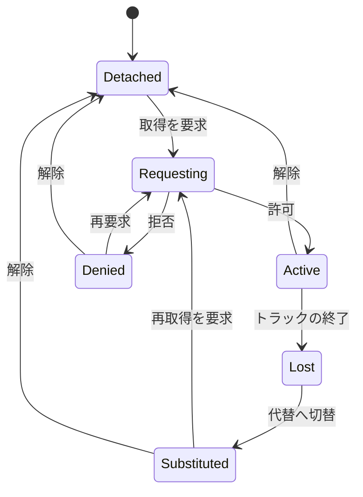

---

## 19. ユースケース図

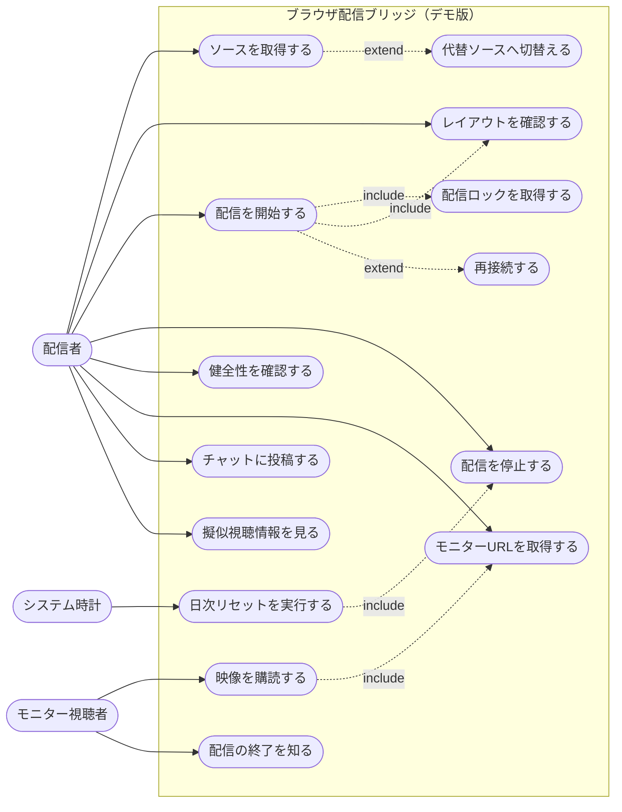

---

## 20. 非機能要件

| 区分 | 要件 |
|---|---|
| 実装方式 | 1 issue のワンショットで実装する |
| 外部通信 | 外部サービスへのネットワーク越しの呼び出しを行わない。資格情報を必要とする通信を持たない |
| 中継負荷 | 中継層は再エンコードを行わない。処理量は接続数に対して線形に留めること |
| 遅延 | 送出から受け口到達までの遅延が、配信中に単調増加し続けないこと |
| 継続性 | タブが非アクティブ・最小化された状態でも合成と送出が継続すること |
| 資源 | 到達ストリームの保持は直近の一定時間分に限り、無制限に蓄積しないこと |
| 同時性 | モニターの同時接続数に上限を設けること |

---

## 21. セキュリティ・個人情報

**セキュリティ**

- 認証・認可を設計に組み込まない
- セッション管理（Cookie ＋ SQLite）を用い、セッションキーをオーナーキーとして全テーブルに付与する
- セッションをまたいだ DB レコードの参照・操作を行えないこと
- 配信トークンは推測不可能な長さとし、セッションキーから導出しないこと。トークンで到達できるのは映像ストリームの購読のみとする
- Bot 対策はハニーポット方式で行う。reCAPTCHA を用いない
- 受信フレームは長さ・種別・時刻の整合を検証し、逸脱するフレームは破棄すること

**個人情報**

| 項目 | 扱い |
|---|---|
| 氏名・ニックネーム | 使用しない。チャットの投稿者は非個人ラベルとする |
| メールアドレス | 使用しない |
| 生年月日・住所・電話番号 | 使用しない |
| セッションキー | 端末識別子として扱う |
| 映像・音声 | 永続化しない。到達ストリームは直近分のみを揮発的に保持し、ファイルとして保存しない |

---

## 22. 運用要件

| 項目 | 内容 |
|---|---|
| DB | SQLite。デプロイ先を問わず SQLite を用いる |
| 日次リセット | JST 03:00 に全テーブルを削除する。実行前に進行中の配信へ停止要求を出し、猶予時間の経過後に削除する。配信ロックも解放する |
| 配信ロックの回収 | 生存通知が途絶えたロックを定期的に解放する |
| 到達ストリーム | 配信終了時に破棄する |
| 測定 | 行わない |
| 保守・監視 | 行わない |

---

## 23. 対応環境と制約

| 項目 | 内容 |
|---|---|
| 対応ブラウザ | ブラウザ内エンコードに対応した最新世代のデスクトップ向けブラウザ |
| 非対応時の扱い | 起動時に能力を検出し、非対応の場合は配信を開始せず、その旨を表示する。代替経路を持たない |
| 対応端末 | デスクトップ。画面共有 API の制約によりモバイルは対象外とする |
| モニター | 対応ブラウザおよびモバイルブラウザで再生可能とする |
| 前提 | 配信者が画面共有・カメラ・マイクの許可を与えられる環境であること。許可が得られない場合はテストカードで配信を成立させる |
